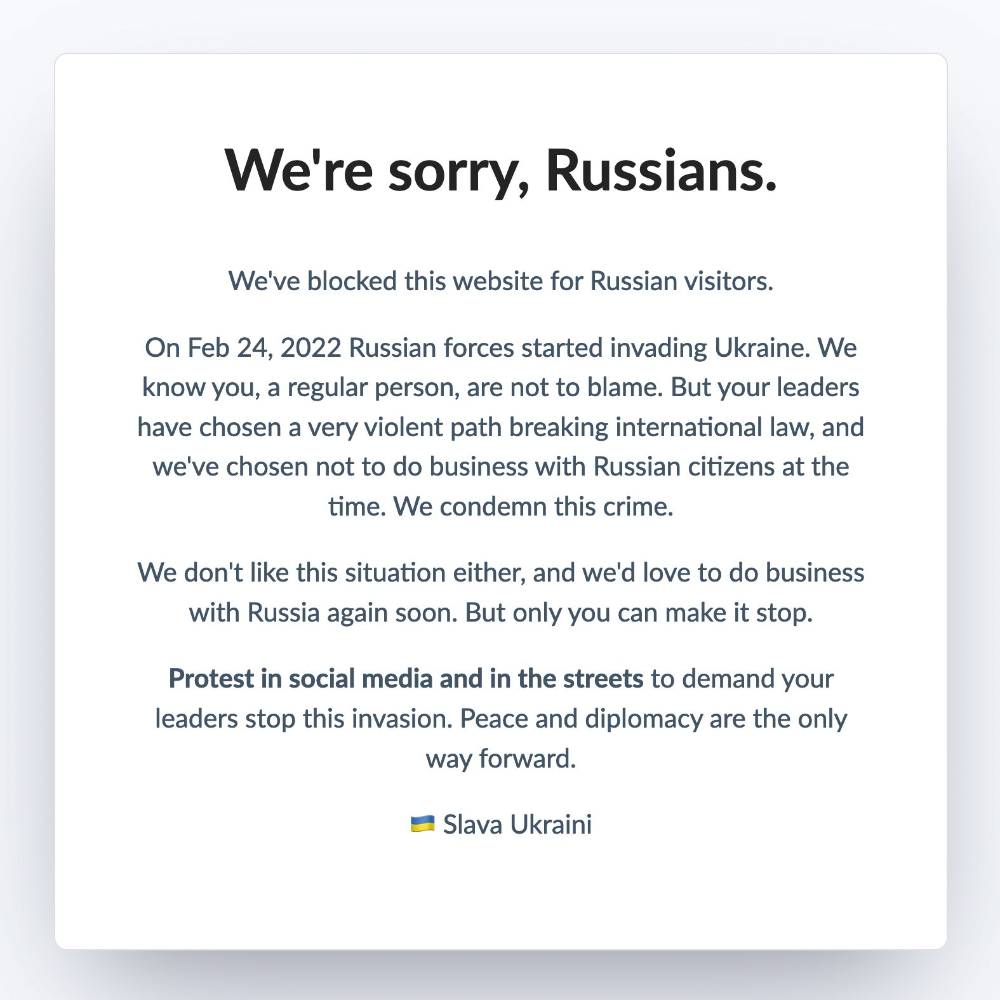

<h1 align="center">wp-embargoed</h1>

A plugin to block all requests from Russia to any WordPress site and display a pro-Ukraine message instead 🇺🇦

---

### What does this plugin do?

The Embargoed plugin checks the IP of visitors coming to your site for their origin. If it detects
a Russian IP, instead of continuing as normal it will block the visit and display a
pro-Ukrainian message.

The message looks as follows:

### Installation

The plugin has been submitted to the official WordPress Plugin Directory
and is currently under review.

You can manually install the plugin using the following steps:

1. Download the [latest .zip](https://github.com/pretzelhands/wp-embargoed/releases/download/1.0/embargoed.zip) of the plugin
2. Copy the contents of the file into a `/wp-content/plugins` folder
3. Activate the "Embargoed" plugin in your admin dashboard or using WP CLI

The plugin will start working immediately and block all visitors from Russia.

### Other technologies

This plugin is supported in a variety of different technology stacks. You can find an exhaustive list in [this repository](https://github.com/rameerez/embargoed-list)

### Collaborate

Please feel free to contact me, [@pretzelhds](https://twitter.com/pretzelhds) or fork this to port it to other platforms, or make PRs to this repo to collaborate.
